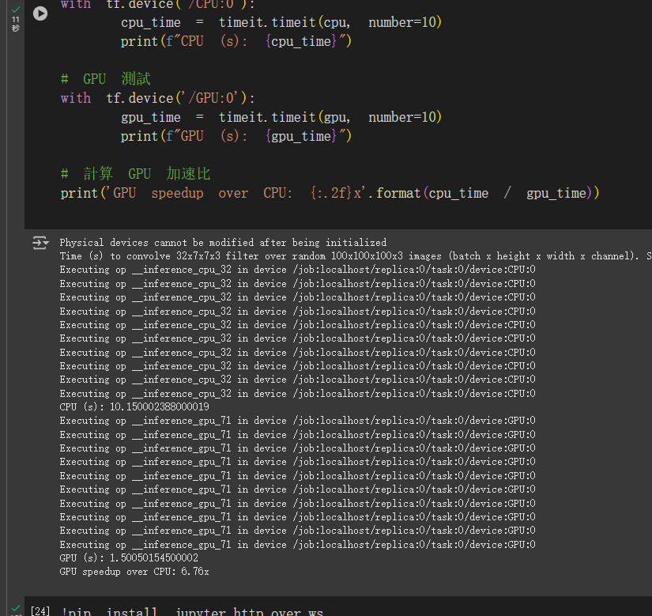
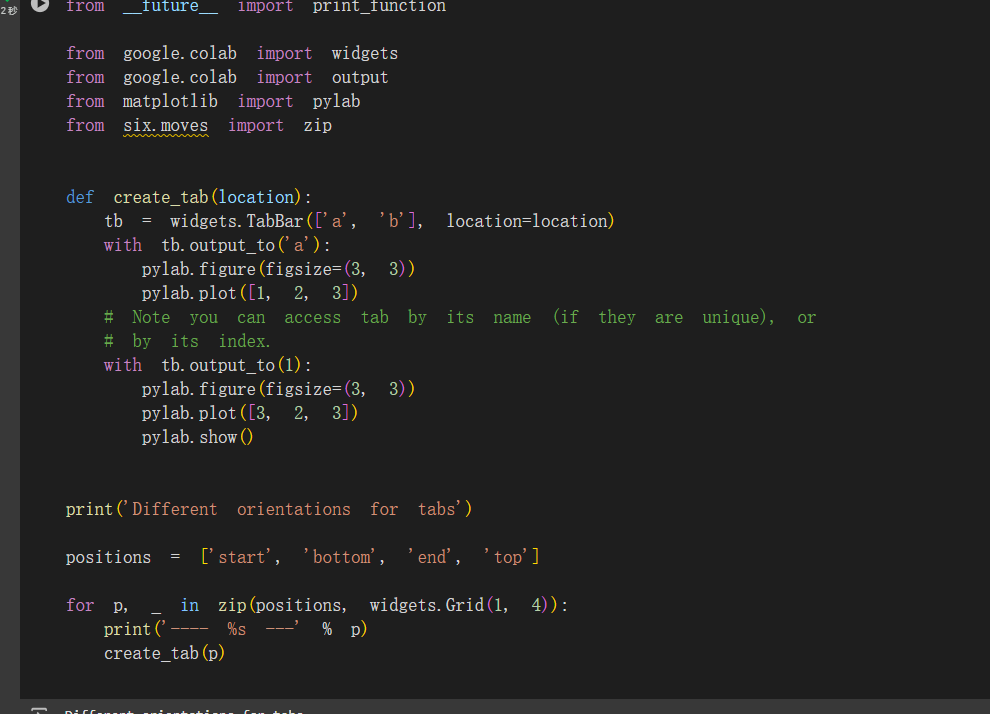

# 人工智慧期末報告-在 Google Colab 中快速实践深度学习
<h3>11124142呂元福</h3>

# Colaboratory

Colaboratory 是一個免費的 Jupyter 筆記本環境，不需要進行任何設置就可以使用，並且完全在雲端運行。 借助 Colaboratory，我們可以在瀏覽器中編寫和執行代碼、保存和共用分析結果，以及利用強大的計算資源，包含 GPU 與 TPU 來運行我們的實驗代碼。

Colab 能夠方便地與 Google Driver 與 Github 連結，我們可以使用 Open in Colab 外掛程式快速打開 Github 上的 Notebook，或者使用類似於 https://colab.research.google... 這樣的鏈接打開。 如果需要將 Notebook 保存回 Github，直接使用 File→Save a copy to GitHub 即可。 譬如筆者所有與 Colab 相關的代碼歸置在了 AIDL-Workbench/colab。
<h2>
依賴與運行時

  
依賴安裝
</h2>

Colab 提供了便捷的依賴安裝功能，允許使用 pip 或者 apt-get 命令進行安裝：

    # Importing a library that is not in Colaboratory
    !pip install -q matplotlib-venn
    !apt-get -qq install -y libfluidsynth1
    
    # Upgrading TensorFlow
    # To determine which version you're using:
    !pip show tensorflow
    
    # For the current version:
    !pip install --upgrade tensorflow
    
    # For a specific version:
    !pip install tensorflow==1.2
    
    # For the latest nightly build:
    !pip install tf-nightly
    
    # Install Pytorch
    from os import path
    from wheel.pep425tags import get_abbr_impl, get_impl_ver, get_abi_tag
    platform = '{}{}-{}'.format(get_abbr_impl(), get_impl_ver(), get_abi_tag())
    
    accelerator = 'cu80' if path.exists('/opt/bin/nvidia-smi') else 'cpu'
    
    !pip install -q http://download.pytorch.org/whl/{accelerator}/torch-0.4.0-{platform}-linux_x86_64.whl torchvision
    
    # Install 7zip reader libarchive
    # https://pypi.python.org/pypi/libarchive
    !apt-get -qq install -y libarchive-dev && pip install -q -U libarchive
    import libarchive
    
    # Install GraphViz & PyDot
    # https://pypi.python.org/pypi/pydot
    !apt-get -qq install -y graphviz && pip install -q pydot
    import pydot
    
    # Install cartopy
    !apt-get -qq install python-cartopy python3-cartopy
    import cartopy

在 Colab 中還可以設置環境變數：

    %env KAGGLE_USERNAME=abcdefgh

我們可以通過如下方式查看 Colab 為我們提供的硬體：

    from tensorflow.python.client import device_lib
    device_lib.list_local_devices()
    
    !ls /proc
    # CPU信息
    !cat /proc/cpuinfo
    # 内存
    !cat /proc/meminfo
    # 版本
    !cat /proc/version
    # 设备
    !cat /proc/devices
    # 空间
    !df

如果需要為 Notebook 啟動 GPU 支援：Click Edit->notebook settings->hardware accelerator->GPU，然後在代碼中判斷是否有可用的 GPU 設備：

    import tensorflow as tf
    device_name = tf.test.gpu_device_name()
    if device_name != '/device:GPU:0':
      raise SystemError('GPU device not found')
    print('Found GPU at: {}'.format(device_name))

  

我們可以通過構建經典的 CNN 捲積層來比較 GPU 與 CPU 在運算上的差異：

    import tensorflow as tf
    import timeit
    
    # See https://www.tensorflow.org/tutorials/using_gpu#allowing_gpu_memory_growth
    config = tf.ConfigProto()
    config.gpu_options.allow_growth = True
    
    with tf.device('/cpu:0'):
      random_image_cpu = tf.random_normal((100, 100, 100, 3))
      net_cpu = tf.layers.conv2d(random_image_cpu, 32, 7)
      net_cpu = tf.reduce_sum(net_cpu)
    
    with tf.device('/gpu:0'):
      random_image_gpu = tf.random_normal((100, 100, 100, 3))
      net_gpu = tf.layers.conv2d(random_image_gpu, 32, 7)
      net_gpu = tf.reduce_sum(net_gpu)
    
    sess = tf.Session(config=config)
    
    # Test execution once to detect errors early.
    try:
      sess.run(tf.global_variables_initializer())
    except tf.errors.InvalidArgumentError:
      print(
          '\n\nThis error most likely means that this notebook is not '
          'configured to use a GPU.  Change this in Notebook Settings via the '
          'command palette (cmd/ctrl-shift-P) or the Edit menu.\n\n')
      raise
    
    def cpu():
      sess.run(net_cpu)
    
    def gpu():
      sess.run(net_gpu)
    
    # Runs the op several times.
    print('Time (s) to convolve 32x7x7x3 filter over random 100x100x100x3 images '
          '(batch x height x width x channel). Sum of ten runs.')
    print('CPU (s):')
    cpu_time = timeit.timeit('cpu()', number=10, setup="from __main__ import cpu")
    print(cpu_time)
    print('GPU (s):')
    gpu_time = timeit.timeit('gpu()', number=10, setup="from __main__ import gpu")
    print(gpu_time)
    print('GPU speedup over CPU: {}x'.format(int(cpu_time/gpu_time)))
    
    sess.close()

### 本地運行

Colab 還支援直接將 Notebook 連接到本地的 Jupyter 伺服器以運行，首先需要啟用 jupyter_http_over_ws 擴展程式：

    pip install jupyter_http_over_ws
    jupyter serverextension enable --py jupyter_http_over_ws

然後在正常方式啟動 Jupyter 伺服器，設置一個標記來明確表明信任來自 Colaboratory 前端的 WebSocket 連接：

    jupyter notebook \
      --NotebookApp.allow_origin='https://colab.research.google.com' \
      --port=8888 \
      --NotebookApp.port_retries=0

然後在 Colab 的 Notebook 中選擇連接到本地代碼執行程式即可。

###  數據與外部模組

    Colab 中的 notebook 和 py 檔案預設都是以 /content/ 作為工作目錄，需要執行一下命令手動切換工作目錄，例如：
    
    import os
    
    path = "/content/drive/colab-notebook/lesson1-week2/assignment2"
    os.chdir(path)
    os.listdir(path)

### Google Driver

在過去進行實驗的時候，大量訓練與測試數據的獲取、存儲與載入一直是令人頭疼的問題; 在 Colab 中，筆者將 Awesome DataSets https://url.wx-coder.cn/FqwyP） 中的相關數據通過 AIDL-Workbench/datasets 中的腳本持久化存儲在 Google Driver 中。

在 Colab 中我們可以將 Google Driver 掛載到當的工作路徑：

    from google.colab import drive
    drive.mount("/content/drive")
    
    print('Files in Drive:')
    !ls /content/drive/'My Drive'

然後通過正常的 Linux Shell 命令來創建與操作：

    # Working with files
    # Create directories for the new project
    !mkdir -p drive/kaggle/talkingdata-adtracking-fraud-detection
    
    !mkdir -p drive/kaggle/talkingdata-adtracking-fraud-detection/input/train
    !mkdir -p drive/kaggle/talkingdata-adtracking-fraud-detection/input/test
    !mkdir -p drive/kaggle/talkingdata-adtracking-fraud-detection/input/valid
    
    # Download files
    !wget -O /content/drive/'My Drive'/Data/fashion_mnist/train-images-idx3-ubyte.gz http://fashion-mnist.s3-website.eu-central-1.amazonaws.com/train-images-idx3-ubyte.gz
    
    # Download and Unzip files
    %env DIR=/content/drive/My Drive/Data/animals/cats_and_dogs
    
    !rm -rf "$DIR"
    !mkdir -pv "$DIR"
    !wget -O "$DIR"/Cat_Dog_data.zip https://s3.amazonaws.com/content.udacity-data.com/nd089/Cat_Dog_data.zip
    
    # remove existing directories
    !(cd "$DIR" && unzip -qqj Cat_Dog_data.zip -d .)

### 外部 Python 檔

Colab 允許我們上傳 Python 檔到工作目錄下，或者載入 Google Driver 中的 Python：

    # Import modules
    import imp
    helper = imp.new_module('helper')
    exec(open("drive/path/to/helper.py").read(), helper.__dict__)
    
    fc_model = imp.new_module('fc_model')
    exec(open("pytorch-challenge/deep-learning-v2-pytorch/intro-to-pytorch/fc_model.py").read(), fc_model.__dict__)

### 檔上傳與下載

Colab 還允許我們在運行腳本時候直接從本地檔上傳，或者將生成的模型下載到本地檔：

    from google.colab import files
    
    # Upload file
    uploaded = files.upload()
    
    for fn in uploaded.keys():
      print('User uploaded file "{name}" with length {length} bytes'.format(
          name=fn, length=len(uploaded[fn])))
    
    # Download file
    with open('example.txt', 'w') as f:
      f.write('some content')
    
    files.download('example.txt')

### BigQuery

如果我們使用了 BigQuery 提供了大數據的查詢與管理功能，那麼在 Colab 中也可以直接引入 BigQuery 中的數據源：

    from google.cloud import bigquery
    
    client = bigquery.Client(project=project_id)
    
    sample_count = 2000
    row_count = client.query('''
      SELECT
        COUNT(*) as total
      FROM `bigquery-public-data.samples.gsod`''').to_dataframe().total[0]
    
    df = client.query('''
      SELECT
        *
      FROM
        `bigquery-public-data.samples.gsod`
      WHERE RAND() < %d/%d
    ''' % (sample_count, row_count)).to_dataframe()
    
    print('Full dataset has %d rows' % row_count)

### 控制件使用

### 網格

Colab 為我們提供了 Grid 以及 Tab 控制項，來便於我們構建簡單的圖表佈局：

    import numpy as np
    import random
    import time
    from matplotlib import pylab
    grid = widgets.Grid(2, 2)
    for i in range(20):
      with grid.output_to(random.randint(0, 1), random.randint(0, 1)):
        grid.clear_cell()
        pylab.figure(figsize=(2, 2))
        pylab.plot(np.random.random((10, 1)))
      time.sleep(0.5)

  TabBar 提供了頁簽化的佈局：

      from __future__ import print_function
    
    from google.colab import widgets
    from google.colab import output
    from matplotlib import pylab
    from six.moves import zip
    
    
    def create_tab(location):
      tb = widgets.TabBar(['a', 'b'], location=location)
      with tb.output_to('a'):
        pylab.figure(figsize=(3, 3))
        pylab.plot([1, 2, 3])
      # Note you can access tab by its name (if they are unique), or
      # by its index.
      with tb.output_to(1):
        pylab.figure(figsize=(3, 3))
        pylab.plot([3, 2, 3])
        pylab.show()
    
    
    print('Different orientations for tabs')
    
    positions = ['start', 'bottom', 'end', 'top']
    
    for p, _ in zip(positions, widgets.Grid(1, 4)):
      print('---- %s ---' % p)
      create_tab(p)

### 表單

值得稱道的是，Colab 還提供了可交互的表單式元件，來方便我們構建可動態輸入的應用：

    #@title String fields
    
    text = 'value' #@param {type:"string"}
    dropdown = '1st option' #@param ["1st option", "2nd option", "3rd option"]
    text_and_dropdown = '2nd option' #@param ["1st option", "2nd option", "3rd option"] {allow-input: true}
    
    print(text)
    print(dropdown)
    print(text_and_dropdown)

